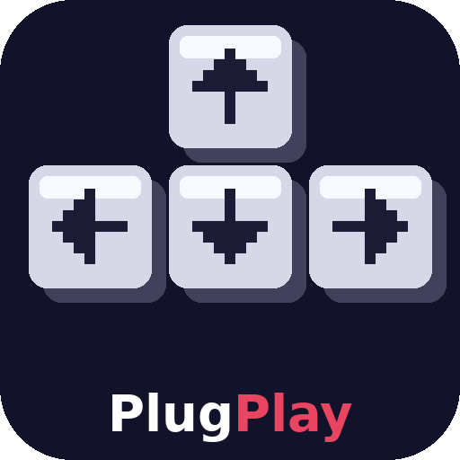

# Clickdev PlugPlay

<p align="center">
  
</p>

<p align="center">
  <strong>Visual drag & drop event system for Godot 4</strong><br/>
  Make games without writing code — Clickteam Fusion style, inside Godot.
</p>

<p align="center">
  
  
  
  
</p>

---

## ✨ What is Clickdev PlugPlay?

Clickdev PlugPlay adds a **visual event editor** to the bottom of your Godot editor. Instead of writing GDScript, you pick **Conditions** and **Actions** from categorized menus — and Clickdev automatically generates the GDScript for you.

Inspired by **Clickteam Fusion** and **Scratch**.

---

## 🎬 How it Works

```
You pick conditions & actions
        ↓
Clickdev Event Editor
        ↓
GDScript Generator
        ↓
Godot runs your game ✅
```

---

## 📋 Features

| Feature | Detail |
|---------|--------|
| 🎮 Visual event editor | Bottom panel inside Godot editor |
| 📋 8 condition categories | General, Input, Object, Collision, Variable, Timer, Scene, Math |
| ⚡ 9 action categories | Movement, Object, Animation, Sound, Variable, Timer, Scene, System, Debug |
| ✅ 30+ conditions | always, key pressed, on floor, var equals, timer done, and more |
| ⚡ 65+ actions | move, jump, play anim, play sound, set var, load scene, and more |
| 🔄 Auto code gen | Translates events → GDScript automatically |
| 👁 Code preview | See the generated GDScript any time |
| 🔢 NOT condition | Negate any condition with one checkbox |
| 💾 Persistent | Events saved inside the .tscn file, no extra files |
| 🆓 Free & Open Source | MIT License |

---

## 📦 Installation

### From Godot Asset Library *(Recommended)*
1. Open your Godot 4 project
2. Click the **AssetLib** tab at the top of the editor
3. Search **"Clickdev PlugPlay"**
4. Click **Download** → **Install**
5. Go to **Project → Project Settings → Plugins**
6. Enable **Clickdev PlugPlay** ✅

### Manual Install
1. Download this repository as ZIP
2. Copy `addons/clickdev_plugplay/` into your project's `addons/` folder
3. Go to **Project → Project Settings → Plugins**
4. Enable **Clickdev PlugPlay** ✅

---

## 🚀 Quick Start

1. Add a **ClickdevEventSheet** node to your scene
2. Click it in the Scene panel → the **🎮 Clickdev** panel opens at the bottom
3. Click **＋ Add Event**
4. Click **Edit** → choose conditions & actions from the menus
5. Click **💾 Save**
6. Press **F5** — your game runs with the events active!

---

## 🧩 Included Nodes

| Node | Base Class | Description |
|------|-----------|-------------|
| `ClickdevEventSheet` | Node | Holds all events. Select it to open the editor. |
| `ClickdevObject` | CharacterBody2D | Game object with gravity, alterable values & helpers. |
| `ClickdevTimer` | Timer | Named timer for use in Clickdev events. |

---

## 📋 Example — Simple Platformer

| # | Conditions | Actions |
|---|-----------|---------|
| 1 | Key held → `move_left` | Move left → `$Player` speed `200` |
| 2 | Key held → `move_right` | Move right → `$Player` speed `200` |
| 3 | Key just pressed → `ui_accept` + Object on floor → `$Player` | Jump → `$Player` force `500` |
| 4 | At start of scene | Start timer → `$FallTimer` seconds `1.0` |
| 5 | Timer done → `$FallTimer` | Restart scene |

---

## 📁 File Structure

```
clickdev-plugplay/
├── addons/
│   └── clickdev_plugplay/          ← install this into your project
│       ├── plugin.cfg
│       ├── plugin.gd
│       ├── LICENSE
│       ├── codegen/
│       │   └── ClickdevCodeGen.gd  ← event → GDScript translator
│       ├── event_editor/
│       │   └── EventEditorPanel.gd ← the visual editor UI
│       └── nodes/
│           ├── ClickdevEventSheet.gd
│           ├── ClickdevObject.gd
│           └── ClickdevTimer.gd
├── screenshots/
│   ├── icon.png                    ← 128×128 icon
│   └── icon_512.png                ← 512×512 icon
├── README.md
├── LICENSE
├── CONTRIBUTING.md
└── .gitignore
```

---

## 🗺 Roadmap

- [ ] Sub-events & event groups
- [ ] Drag to reorder events
- [ ] Copy / paste events
- [ ] More built-in conditions & actions
- [ ] Runtime event debugger
- [ ] Custom user-defined conditions & actions
- [ ] **Clickdev Powers** — standalone engine (coming soon)

---

## 🤝 Contributing

Contributions welcome! See [CONTRIBUTING.md](CONTRIBUTING.md) for how to add new conditions and actions.

---

## 📄 License

**MIT** — free to use in any project, personal or commercial. See [LICENSE](LICENSE).

---

## 👤 Author

**Ahmad Ilham Kurniawan**

Part of the **Clickdev** project — a free & open-source alternative to Clickteam Fusion, built on Godot 4.

---

*Clickdev PlugPlay is not affiliated with Clickteam or the Godot Foundation.*
*Godot Engine is used under the MIT License.*
